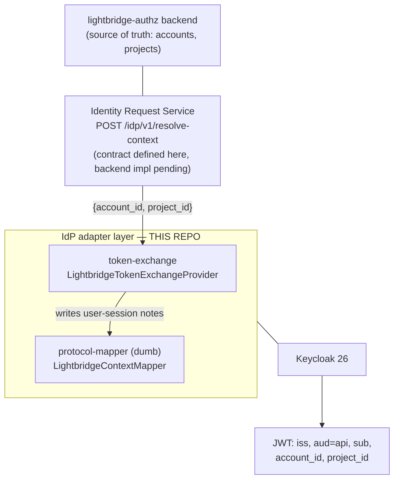
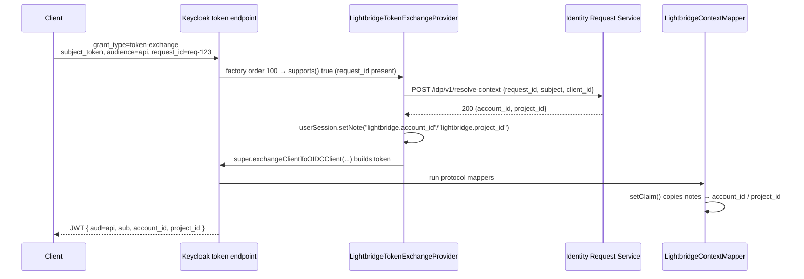

# Architecture

This repo is the **Keycloak IdP-adapter layer** of a portable token-orchestration design
([ADR-0001](adr/0001-idp-agnostic-token-orchestration.md)). The IdP never understands the business model:
`request_id` is the only bridge, `aud` stays a clean OAuth audience, and all resolution logic is external.

## Layers

## The request_id flow

When no `request_id` is present, `supports()` returns false and Keycloak's built-in
`StandardTokenExchangeProvider` (order 10) handles the exchange unchanged.

## Keycloak 26.6 SPI surface used

| Concern | Type | Package | Notes |
| --- | --- | --- | --- |
| Interception | `TokenExchangeProvider` / `TokenExchangeProviderFactory` | `org.keycloak.protocol.oidc` | SPI id `oauth2-token-exchange`; select by `order()` + `supports()` |
| Base impl extended | `StandardTokenExchangeProvider` | `org.keycloak.protocol.oidc.tokenexchange` | override only `exchangeClientToOIDCClient(...)` |
| Request data | `TokenExchangeContext#getFormParams()` | `org.keycloak.protocol.oidc` | where `request_id` enters |
| Claim emission | `AbstractOIDCProtocolMapper` + `OIDC{AccessToken,IDToken}Mapper`, `UserInfoTokenMapper` | `org.keycloak.protocol.oidc.mappers` | override `setClaim(...)` |
| Notes | `UserSessionModel#setNote/getNote` | `org.keycloak.models` | contract between the two layers |

## Modules

| Module | Responsibility | Keycloak dep |
| --- | --- | --- |
| `spi-common` | `ResolvedContext`, `LightbridgeConfig`, `LightbridgeSessionNotes` | none |
| `context-client` | `ContextResolver` seam + `HttpContextResolver` (JDK HttpClient) | none |
| `token-exchange` | `LightbridgeTokenExchangeProvider(Factory)`, config mapping | `compileOnly` |
| `protocol-mapper` | `LightbridgeContextMapper` (dumb) | `compileOnly` |
| `dist` | collects the four provider jars into `build/providers` | — |
| `integration-tests` | boots real Keycloak, asserts SPI registration | test only |
